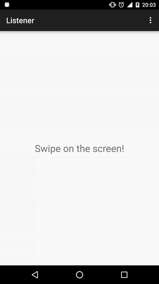

swipe [](http://android-arsenal.com/details/1/3323)
=====

detects swipe events on Android with listener and RxJava Observable


Check out an exemplary **[animation](#example)**!

JavaDoc is available at: http://pwittchen.github.io/swipe/RxJava2.x

| Current Branch | Branch  | Artifact Id | Build Status  | Maven Central |
|:--------------:|:-------:|:-----------:|:-------------:|:-------------:|
| | [`RxJava1.x`](https://github.com/pwittchen/swipe/tree/RxJava1.x) | `swipe` | [](https://travis-ci.org/pwittchen/swipe) |  |
| :ballot_box_with_check: | [`RxJava2.x`](https://github.com/pwittchen/swipe/tree/RxJava2.x) | `swipe-rx2` | [](https://travis-ci.org/pwittchen/swipe) |  |

Contents
--------
- [Usage](#usage)
  - [Imperative way - Listener](#imperative-way---listener)
  - [Reactive way - RxJava](#reactive-way---rxjava)
- [Configuring swipe threshold](#configuring-swipe-threshold)
- [Example](#example)
- [Download](#download)
- [Tests](#tests)
- [Code style](#code-style)
- [Static code analysis](#static-code-analysis)
- [References](#references)
- [License](#license)

Usage
-----

### Imperative way - Listener

**Step 1**: Create `Swipe` attribute in the `Activity`:

```java
private Swipe swipe;
```

**Step 2**: Initialize `Swipe` object and set listener:

```java
@Override protected void onCreate(Bundle savedInstanceState) {
  super.onCreate(savedInstanceState);
  
  setContentView(R.layout.activity_main);
  info = (TextView) findViewById(R.id.info);
  
  swipe = new Swipe();
  swipe.setListener(new SwipeListener() {
    @Override public void onSwipingLeft(final MotionEvent event) {
      info.setText("SWIPING_LEFT");
    }

    @Override public void onSwipedLeft(final MotionEvent event) {
      info.setText("SWIPED_LEFT");
    }

    @Override public void onSwipingRight(final MotionEvent event) {
      info.setText("SWIPING_RIGHT");
    }

    @Override public void onSwipedRight(final MotionEvent event) {
      info.setText("SWIPED_RIGHT");
    }

    @Override public void onSwipingUp(final MotionEvent event) {
      info.setText("SWIPING_UP");
    }

    @Override public void onSwipedUp(final MotionEvent event) {
      info.setText("SWIPED_UP");
    }

    @Override public void onSwipingDown(final MotionEvent event) {
      info.setText("SWIPING_DOWN");
    }

    @Override public void onSwipedDown(final MotionEvent event) {
      info.setText("SWIPED_DOWN");
    }
  });
}
```

**Step 3**: override `dispatchTouchEvent(MotionEvent event)`:

```java
@Override public boolean dispatchTouchEvent(MotionEvent event) {
  swipe.dispatchTouchEvent(event);
  return super.dispatchTouchEvent(event);
}
```

### Reactive way - RxJava

**Step 1**: Create `Swipe` attribute and `Subscription` in the `Activity`:

```java
private Swipe swipe;
private Disposable disposable;
```

**Step 2**: Initialize `Swipe` object and subscribe `Observable`:

```java
@Override protected void onCreate(Bundle savedInstanceState) {
  super.onCreate(savedInstanceState);
  setContentView(R.layout.activity_main);
  info = (TextView) findViewById(R.id.info);
  
  swipe = new Swipe();
  
  disposable = swipe.observe()
      .subscribeOn(Schedulers.computation())
      .observeOn(AndroidSchedulers.mainThread())
      .subscribe(swipeEvent -> info.setText(swipeEvent.toString()));
}
```

`SwipeEvent` is an enum with the following values:

```java
public enum SwipeEvent {
  SWIPING_LEFT,
  SWIPED_LEFT,
  SWIPING_RIGHT,
  SWIPED_RIGHT,
  SWIPING_UP,
  SWIPED_UP,
  SWIPING_DOWN,
  SWIPED_DOWN
}
```

**Step 3**: override `dispatchTouchEvent(MotionEvent event)`:

```java
@Override public boolean dispatchTouchEvent(MotionEvent event) {
  swipe.dispatchTouchEvent(event);
  return super.dispatchTouchEvent(event);
}
```

**Step 4**: dispose previously created `Disposable` when it's no longer needed:

```java
@Override protected void onPause() {
  super.onPause();
  if (disposable != null && !disposable.isDisposed()) {
    disposable.dispose();
  }
}
```

Configuring swipe threshold
---------------------------

If you want to configure swipe threshold to adjust swipe sensitivity, you can use the following constructor:

```java
Swipe(int swipingThreshold, int swipedThreshold)
```

Default `swipingThreshold` is equal to `20` and default `swipedThreshold` is equal to `100`.
In the case of using `Swipe()` constructor, these values are set.
Decreasing these values will increase swiping and swiped events sensitivity.
We can adjust them manually for our needs.

Example
-------

Exemplary application is located in `app` directory of this repository.

If you would like to know, how to use this library with Kotlin, check `app-kotlin` directory in this repository.

Below, you can see an animation presenting how sample application works.



Download
--------

You can depend on the library through Maven:

TBD.

Tests
-----

To execute unit tests run:

```
./gradlew test
```

Code style
----------

Code style used in the project is called `SquareAndroid` from Java Code Styles repository by Square available at: https://github.com/square/java-code-styles.

Static code analysis
--------------------

Static code analysis runs Checkstyle, FindBugs, PMD and Lint. It can be executed with command:

 ```
 ./gradlew check
 ```

Reports from analysis are generated in `library/build/reports/` directory.

References
----------

- [better gesture detector project](https://github.com/Polidea/better-gesture-detector)
- [detecting swipe gesture in mobile application](http://blog.wittchen.biz.pl/detecting-swipe-gesture-in-mobile-application/)
- [dispatchTouchEvent(event) method in documentation](http://developer.android.com/reference/android/view/ViewGroup.html#dispatchTouchEvent(android.view.MotionEvent))
- [MotionEvent class in documentation](http://developer.android.com/reference/android/view/MotionEvent.html)

License
-------

    Copyright 2016 Piotr Wittchen

    Licensed under the Apache License, Version 2.0 (the "License");
    you may not use this file except in compliance with the License.
    You may obtain a copy of the License at

       http://www.apache.org/licenses/LICENSE-2.0

    Unless required by applicable law or agreed to in writing, software
    distributed under the License is distributed on an "AS IS" BASIS,
    WITHOUT WARRANTIES OR CONDITIONS OF ANY KIND, either express or implied.
    See the License for the specific language governing permissions and
    limitations under the License.
