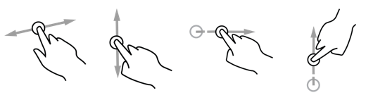

Swipes
=============

Detects swipe events on Android.

Documentation and samples will be provided later.

References
----------

- [better gesture detector project](https://github.com/Polidea/better-gesture-detector)
- [detecting swipe gesture in mobile application](http://blog.wittchen.biz.pl/detecting-swipe-gesture-in-mobile-application/).
