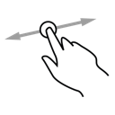
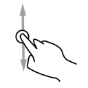
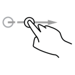
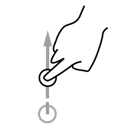

SwipeDetector
=============

Detecting swipe events on Android.

Overview
--------

[`SwipeDetector`](https://github.com/pwittchen/SwipeDetector/blob/master/app/src/main/java/pwittchen/com/swipedetector/SwipeDetector.java) class with `SwipeListener` interface allows to detect the following swipe events in Android apps:
- onSwipingLeft
- onSwipedLeft
- onSwipingRight
- onSwipedRight
- onSwipingUp
- onSwipedUp
- onSwipingDown
- onSwipedDown

Below, you can see examplary swipe gestures, which can be detected with `SwipeDetector` (swiping horizontally - right or left, swiping vertically - up or down, swiped right and swiped up). All detectable swipe gestures are listed above and are available in `SwipeListener` interface.

Example
-------

Exemplary usage of `SwipeDetector` is shown in [`SwipeDetectorActivity`](https://github.com/pwittchen/SwipeDetector/blob/master/app/src/main/java/pwittchen/com/swipedetector/SwipeDetectorActivity.java).

References
----------

If you are intereseted in this topic, read blog post about [detecting swipe gesture in mobile application](http://blog.wittchen.biz.pl/detecting-swipe-gesture-in-mobile-application/).
